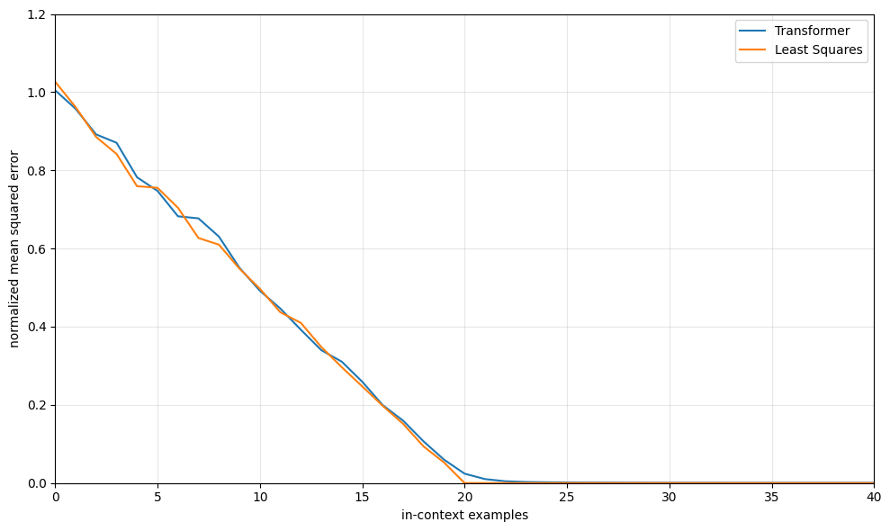
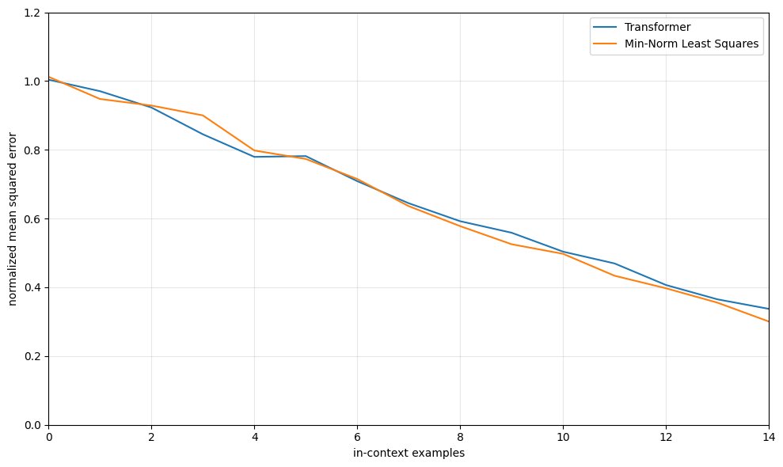
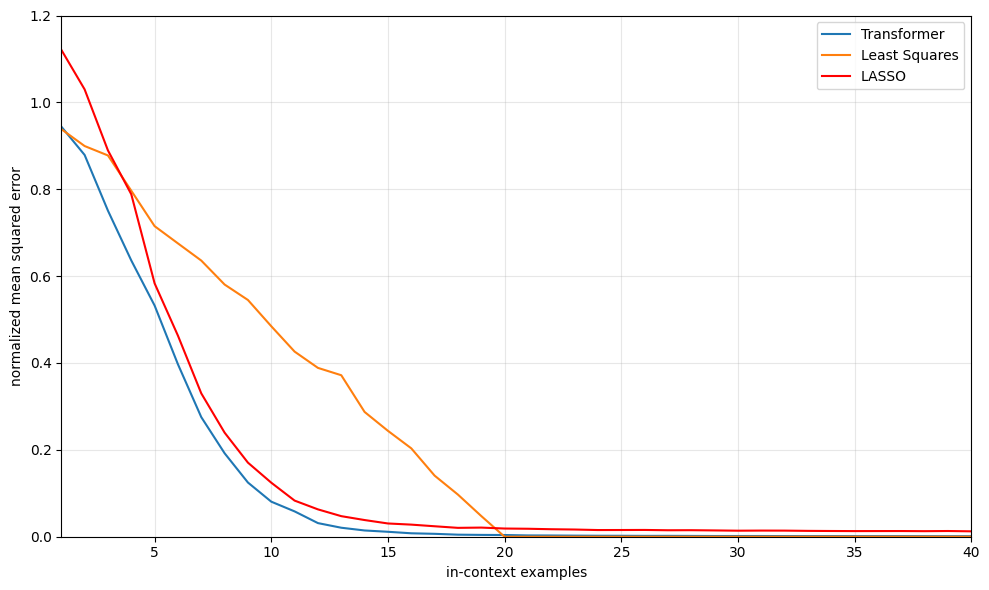

# Investigating In-Context Learning of Linear Regression in Transformers

This repository attempts to reproduce and extend the results from _What Can Transformers Learn In Context? A Case Study of Simple Functions?_ (Garg et al. 2023). Specifically, I aim to show that transformers are able to achieve comparable performance to specialized learners for a series of linear regression tasks. The specific tasks and specialized learners are:

1. Underparameterized (standard) Linear Regression &rarr; Least Squares
2. Overparameterized Linear Regression &rarr; Min-Norm Least Squares
3. Sparse Linear Regression &rarr; LASSO

At a high level, to evaluate transformer models, we start with an untrained GPT-style transformer and train it separately for each of the three linear regression settings. Each model is trained from scratch using a curriculum that slowly increases the difficulty of the task, beginning with small dimensions and a small number of in-context examples and eventually reaching the full problem.

For every training step, we generate a new synthetic linear regression task. Inputs are drawn i.i.d. from a standard Gaussian,

$$
x_i \sim \mathcal{N}(0, I_d), \quad w \sim \mathcal{N}(0, I_d), \quad y_i = w^\top x_i,
$$

with the option to force $w$ to be sparse in the sparse setting. The transformer never sees $w$. Instead, it has to infer the underlying linear mapping from the examples it is given.

The model receives $n$ in-context examples followed by a query input:

$$
(x_1, y_1,\, x_2, y_2,\, \ldots,\, x_n, y_n,\, x_{\text{query}}),
$$

and its job is to predict $y_{\text{query}}$. The sequence is processed autoregressively, so the model must piece together information from earlier pairs to estimate the linear function.

Training minimizes mean squared error between the model’s prediction and the true value of $y_{\text{query}}$. Because every batch contains newly sampled tasks, the model learns how to perform linear regression in context rather than memorizing any fixed dataset.

After training, we generate new evaluation tasks and measure performance by plotting in-context learning curves. These curves show prediction error as we vary the number of in-context examples $n$. We then compare the transformer’s performance curve to the corresponding classical baseline for each setting: least squares, minimum-norm least squares, and LASSO.

## Structure

The repository is structured as follows:

```
├── src/
│   ├── baselines.py        # Least squares and LASSO implementations
│   ├── curriculum.py       # Training curriculum
│   ├── data_sampler.py     # Data & task generation
│   ├── eval.ipynb          # Evaluation versus baselines, visualizations
│   ├── losses.py           # Loss functions
│   ├── model_utils.py      # Model loading and evaluation functions
│   ├── model.py            # Transformer model architecture
│   ├── train.py            # Training loop
```

`baselines.py` computes baseline curves for least squares, min-norm least squares, and LASSO estimators.

`curriculum.py` contains the implementation of a simple curriculum scheduler that gradually increases input dimensionality and in-context examples during training.

`data_sampler.py` provides helper functions to generate synthetic linear regression tasks by sampling Gaussian inputs and weight vectors, then computing outputs.

`eval.ipynb` evaluates a trained transformer's in-context learning performance on linear regression tasks by generating error curves compared to baselines like least squares and LASSO. 

`losses.py` defines helper functions to calculate error/loss functions between predictions and targets.

`model_utils.py` contains helper functions to load models from checkpoints and also evaluate in-context learning performance.

`model.py` defines the transformer architecture used for the in-context learning experiments, following a GPT-2 style backbone.

`train.py` is the main training entry point, it configures different linear regression settings, constructs the transformer model and curriculum, then runs the training loop with checkpointing and snapshotting.

## Getting Started

1. Clone the repository and switch to the correct branch.

```
git clone https://github.com/Shou-Yue/DSC180a-ICL-A11.
cd DSC180a-ICL-A11
git checkout anish
```

2. Install the required dependencies using `conda`. 

```
conda env create -f environment.yml
conda activate in-context-learning
```

## Training

To train, `cd` into the `src` folder. From here, you can train a model for one of three linear regression settings: underparameterized (standard), overparameterized, or sparse. `train.py` is the main entry point.

To start one of these training jobs, run the following:

```
python train.py --setting underparameterized
python train.py --setting overparameterized
python train.py --setting sparse
```

### Shared Training Setup

All three settings share the same transformer architecture and most training hyperparameters. Additionally, they will all checkpoint to the corresponding folder under `models/`.

Model Architecture
- Input Dimension: `20`
- Maximum Sequence Length: `101`
- Embedding Size: `256`
- Attention Layers: `12`
- Attention Heads: `8`
- Backbone: GPT-2 style transformer (`GPT2Model` from `transformers`)

Training Hyperparameters
- Batch Size: `64`
- Optimizer: `Adam`
- Learning Rate: `1e-4`
- Training Steps: `500k`

The training script attempts to use a GPU if available, otherwise it falls back to using the CPU. It is **strongly recommended to use a GPU for training**.

### Curriculum

Each setting also has a different curriculum that is parameterized by the starting dimension, ending dimension, dimension increment, starting number of in-context points, ending number of in-context points, in-context points increment, and the interval at which to increment at. 

### Underparameterized (Standard)

This setting corresponds to standard underparameterized linear regression where `n` > `d` along with a dense ground truth vector. 

- Output Directory: `models/underparameterized_linear_regression`
- Sparsity: `None`
- Curriculum: 
  - Dimensions:
    - Starting Dimension: `5`
    - Ending Dimensions: `20`
    - Dimension Increment: `1`
  - Points:
    - Starting Points: `11`
    - Ending Points: `41`
    - Points Increment: `2`
  - Update Interval: `2000` training steps

### Overparameterized

This setting corresponds to overparameterized linear regression where `d` > `n` along with a dense ground truth vector. 

- Output Directory: `models/overparameterized_linear_regression`
- Sparsity: `None`
- Curriculum: 
  - Dimensions:
    - Starting Dimension: `20`
    - Ending Dimensions: `20`
    - Dimension Increment: `0`
  - Points:
    - Starting Points: `5`
    - Ending Points: `15`
    - Points Increment: `1`
  - Update Interval: `2000` training steps

### Sparse

This setting corresponds to sparse linear regression where `n` > `d` along with a weight vector with a small number of nonzero entries in the ground truth vector. 

- Output Directory: `models/sparse_linear_regression`
- Sparsity: `3`
- Curriculum: 
  - Dimensions:
    - Starting Dimension: `5`
    - Ending Dimensions: `20`
    - Dimension Increment: `1`
  - Points:
    - Starting Points: `11`
    - Ending Points: `41`
    - Points Increment: `2`
  - Update Interval: `2000` training steps

## Evaluation

Once the transformers have been trained, run `eval.ipynb` to compare their performance with the corresponding baselines.

### Setup

Evaluation is done on fresh tasks that the model hasn't seen during training. For each setting, we load the trained model and evaluate it across different numbers of in-context examples (`n`), using inputs that are alwayus 20-dimensionsal. For each value of `n`, the model is asked to predict the query output . We then compare the model's prediction to the appropriate baseline (least squares, min-norm least squares, or LASSO) to see how well the model performs as the number in-context examples increases. 

### Metrics

The main evaluation metric is the mean squared error (MSE) on the query outputs, normalized by the number of nonzero entries in the ground truth weight vector. We apply this normalization in all settings to keep the scale of the error comparable, since the difficulty of the prediction depends on how many coordinates of the true weight vector actually matter. For each value of \( n \), we compute this normalized MSE and average it over many randomly sampled test tasks to obtain a stable estimate of the model’s performance.

### Plots



This plot shows the in-context learning curve for the underparameterized setting. The x-axis is the number of in-context examples, and the y-axis is the normalized mean squared error on the query prediction. The transformer’s performance (blue) closely tracks the least squares baseline (orange). As `n` increases, both methods steadily decrease in error, eventually reaching near-zero once the model has seen enough examples to fully identify the underlying linear function. Overall, the transformer essentially matches the classical least squares solution across the entire range of context sizes.



This plot shows the in-context learning curve for the overparameterized setting, where the number of dimensions is larger than the number of examples. The transformer (blue) and the minimum-norm least squares baseline (orange) behave almost the same across all values of `n`. As the model sees more examples, both methods steadily reduce their prediction error at a similar rate, showing that the transformer is learning to solve the task about as well as the classical baseline.



This plot shows the in-context learning curve for the sparse setting, where the true weight vector has only a few nonzero entries. The transformer (blue) closely matches the performance of LASSO (red), which is the classical method designed for sparse regression. Both methods improve rapidly as they see more examples and reach near-zero error with roughly the same number of in-context points. Standard least squares (orange) performs noticeably worse in this regime because it does not account for sparsity.

### References

Code was taken and modified from this [repository](https://github.com/dtsip/in-context-learning/tree/main), provided by the authors of _What Can Transformers Learn In Context? A Case Study of Simple Functions?_ (Garg et al. 2023).